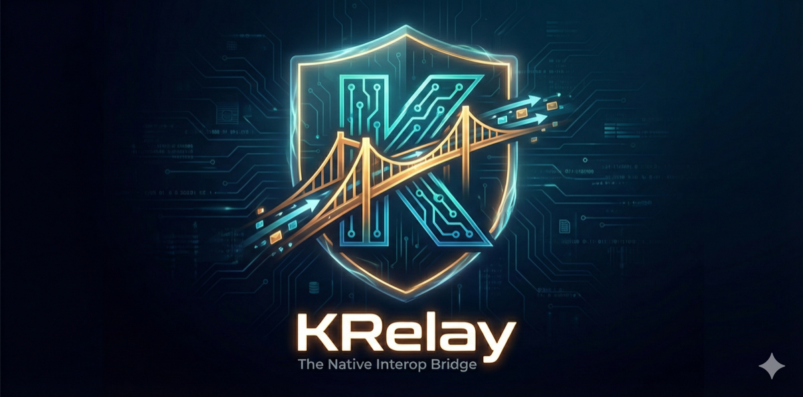

# KRelay

> **The Native Interop Bridge for Kotlin Multiplatform**
>
> _No Memory Leaks • Sticky Queue • Safe Dispatch_

[](http://kotlinlang.org)
[](https://kotlinlang.org/docs/multiplatform.html)
[](https://github.com/brewkits/krelay/releases)
[](LICENSE)

<p align="center">
  
</p>

---

## 🎯 Why KRelay? Three Core Value Propositions

### 1. Clean Native Interop Without Boilerplate

**The Challenge:** Calling platform-specific code from shared ViewModels traditionally requires complex Flow/Channel patterns with LaunchedEffect collectors.

**KRelay's Solution:** Fire-and-forget dispatch pattern

```kotlin
// Shared ViewModel - Clean and simple
class LoginViewModel {
    fun onLoginSuccess() {
        KRelay.dispatch<NavigationFeature> { it.goToHome() }
        // No Flow, no LaunchedEffect, no collectAsState
    }
}
```

**Key Benefits:**
- ✅ **Zero Boilerplate**: Single `dispatch` call replaces `SharedFlow` + `collectAsState` + `LaunchedEffect`
- ✅ **Lifecycle-Safe**: Automatic WeakReference prevents memory leaks
- ✅ **Reliable**: Sticky Queue ensures events survive rotation/lifecycle changes

---

### 2. Better Alternative to SharedFlow for One-Off Events

**The SharedFlow Problem:**

```kotlin
// ❌ Traditional approach: Complex and error-prone
class LoginViewModel {
    private val _navigationEvents = MutableSharedFlow<NavigationEvent>()
    val navigationEvents = _navigationEvents.asSharedFlow()

    fun onLoginSuccess() {
        viewModelScope.launch {
            _navigationEvents.emit(NavigationEvent.GoToHome)
        }
    }
}

@Composable
fun LoginScreen(viewModel: LoginViewModel) {
    val events = viewModel.navigationEvents.collectAsState(initial = null)

    LaunchedEffect(events.value) {
        events.value?.let { event ->
            when (event) {
                is NavigationEvent.GoToHome -> navigator.navigate("home")
            }
        }
    }
    // Issues: Events fire multiple times on rotation, need consumed tracking
}
```

**KRelay Solution:**

```kotlin
// ✅ Clean and safe
class LoginViewModel {
    fun onLoginSuccess() {
        KRelay.dispatch<NavigationFeature> { it.goToHome() }
    }
}

@Composable
fun LoginScreen(viewModel: LoginViewModel) {
    // No LaunchedEffect needed - KRelay handles everything
}
```

**Comparison:**

| Aspect | SharedFlow Pattern | KRelay |
|--------|-------------------|--------|
| Boilerplate | `MutableSharedFlow` + `emit` + `collectAsState` + `LaunchedEffect` | Single `dispatch` call |
| Rotation handling | Events may fire multiple times, needs manual tracking | Automatic via Sticky Queue |
| Lifecycle safety | Must use `lifecycleScope` carefully | Built-in WeakReference |
| Event loss | Can lose events if collected late | Never lost - queued and replayed |

---

### 3. Seamless Integration with Navigation Libraries

**The Pattern:** KRelay acts as a decoupling layer between business logic and navigation frameworks (Voyager, Decompose, Compose Navigation).

```kotlin
// 1. Define contract (commonMain)
interface NavFeature : RelayFeature {
    fun goToHome()
    fun goToProfile(userId: String)
}

// 2. Use in ViewModel (commonMain) - Zero dependencies
class LoginViewModel {
    fun onLoginSuccess(user: User) {
        KRelay.dispatch<NavFeature> { it.goToHome() }
    }
}

// 3. Implement with Voyager (platform code)
class VoyagerNavImpl(private val navigator: Navigator) : NavFeature {
    override fun goToHome() = navigator.push(HomeScreen())
    override fun goToProfile(userId: String) = navigator.push(ProfileScreen(userId))
}

// 4. Wire at app root
@Composable
fun App() {
    Navigator(LoginScreen()) { navigator ->
        LaunchedEffect(navigator) {
            KRelay.register(VoyagerNavImpl(navigator))
        }
        CurrentScreen()
    }
}
```

**Architecture Benefits:**
- **Voyager/Decompose/Navigation**: Manages navigation stack
- **KRelay**: Bridges shared code → platform navigation
- **ViewModel**: Pure business logic, testable without mocking navigation

**Why This Matters:**
- ✅ ViewModels independent of navigation library
- ✅ Easy testing without Navigator mocks
- ✅ Switch navigation frameworks without touching ViewModels
- ✅ Clean separation of concerns

See [Integration Guide](docs/INTEGRATION_GUIDE.md) for complete examples with Voyager, Decompose, and Compose Navigation.

---

## 🔥 The Two Core Problems KRelay Solves

### 1. 💥 Memory Leaks from Strong References
**DIY Problem:**
```kotlin
// ❌ Common DIY mistake
object MyBridge {
    private var activity: Activity? = null  // Strong reference!
    // Activity leaks when user rotates screen
}
```

**KRelay Solution:**
```kotlin
// ✅ Automatic weak references
KRelay.register<ToastFeature>(AndroidToast(activity))
// Activity auto-cleanup when destroyed. Zero leaks.
```

**Why It Matters:**
- Activities/ViewControllers are **NOT cleaned up** with strong references
- Causes OutOfMemoryError crashes in production
- KRelay uses **WeakReference** automatically - when Activity/ViewController is destroyed, reference is cleared

### 2. 🕳️ Lost Commands During Rotation/Lifecycle
**DIY Problem:**
```kotlin
// ❌ Command dispatched before UI is ready
viewModelScope.launch {
    val data = repository.load()
    // Activity not created yet → command lost!
    nativeBridge.showToast("Loaded")
}
```

**KRelay Solution:**
```kotlin
// ✅ Sticky Queue - Commands never lost
viewModelScope.launch {
    val data = repository.load()
    KRelay.dispatch<ToastFeature> { it.show("Loaded") }
    // Queued if UI not ready → Auto-replays when Activity registers
}
```

**Why It Matters:**
- ViewModels survive rotation, but Activities don't
- DIY solutions drop commands when UI isn't ready
- KRelay's **Sticky Queue** holds commands and replays them automatically

---

## ✨ Three Core Guarantees

1. **🛡️ No Memory Leaks**: Automatic WeakReference management - Activities/ViewControllers cleaned up properly
2. **📦 Sticky Queue**: Commands never lost during rotation/lifecycle - Auto-replay when UI ready
3. **🧵 Thread Safety**: All commands execute on Main/UI thread - No threading crashes

## 🎯 Philosophy

### Unix Philosophy: "Do One Thing and Do It Well"

**KRelay's Single Responsibility:**
> Guarantee safe, leak-free dispatch of UI commands from Kotlin shared code to native platforms.

That's it. Nothing more.

**Fire-and-Forget Pattern**: Kotlin developers just "dispatch" commands without worrying about:
- Thread management
- Lifecycle coordination
- Memory leaks
- Missing implementations

KRelay handles everything automatically.

### What KRelay Is

✅ **A Messenger** - Delivers commands from shared code to platform UI
✅ **Fire-and-Forget** - Dispatch and move on, no waiting
✅ **UI-Focused** - Toast, Navigation, Dialogs, Haptics
✅ **Lifecycle-Aware** - Handles rotation, recreation automatically

### What KRelay Is NOT

❌ **Not an RPC Framework** - No request-response, no return values
❌ **Not State Management** - Use StateFlow/Redux for that
❌ **Not a Background Worker** - Use WorkManager/Coroutines
❌ **Not a DI Framework** - Use Koin/Hilt for dependency injection
❌ **Not a Data Layer** - Use Repository pattern for data

**Why the Strict Focus?**

Because libraries that try to do everything end up doing nothing well. EventBus tried to be everything → became unmaintainable spaghetti code. KRelay stays focused → stays simple, reliable, and maintainable.

**If you need:**
- **Return values** → Use `expect/actual` functions
- **State management** → Use `StateFlow`
- **Background work** → Use `Dispatchers.IO` + `WorkManager`
- **Bi-directional communication** → Use Repository pattern with suspend functions

KRelay is the **bridge for one-way UI commands**. That's its superpower.

## ✨ Features in KRelay 

### 1. 🛡️ No Memory Leaks (Automatic WeakReference)

**The Problem with DIY:**
Most developers use strong references and forget to clear them:

```kotlin
// ❌ DIY code - Memory leak!
object MyNativeBridge {
    var toastHandler: ToastHandler? = null
    // Forgot to set to null in onDestroy() → LEAK
}
```

**KRelay's Solution:**
```kotlin
// ✅ KRelay - Zero memory leaks
override fun onCreate(savedInstanceState: Bundle?) {
    super.onCreate(savedInstanceState)
    KRelay.register<ToastFeature>(AndroidToast(this))
    // WeakReference used internally
    // Auto-cleanup when Activity destroyed
    // NO manual null assignment needed!
}
```

**Proof:**
- Run Android Profiler → Rotate screen 10 times → Memory stays flat
- No `OutOfMemoryError` in production
- Activities properly garbage collected

### 2. 📦 Sticky Queue (Never Lose Commands)

**The Problem with DIY:**
Commands dispatched before UI is ready are lost forever:

```kotlin
// ❌ DIY code - Command lost!
class ViewModel {
    init {
        viewModelScope.launch {
            val data = load()
            MyBridge.showToast("Done") // Activity not created yet!
        }
    }
}
```

**KRelay's Solution:**
```kotlin
// ✅ KRelay - Commands preserved
class ViewModel {
    init {
        viewModelScope.launch {
            val data = load()
            KRelay.dispatch<ToastFeature> { it.show("Done") }
            // Queued if Activity not ready
            // Auto-replays when Activity calls register()
        }
    }
}

// Later... Activity is created
override fun onCreate(savedInstanceState: Bundle?) {
    KRelay.register<ToastFeature>(impl)
    // ⚡ Queued "Done" toast shows immediately!
}
```

**Real-World Scenarios:**
- ✅ **Cold Start**: ViewModel loads data before Activity created
- ✅ **Screen Rotation**: Commands survive Activity recreation
- ✅ **Background→Foreground**: Commands replay when app returns
- ✅ **Slow Init**: UI registers late, commands still execute

### 3. 🧵 Thread Safety (Auto Main Thread Dispatch)

```kotlin
// From any thread in shared code
KRelay.dispatch<ToastFeature> {
    it.show("Hello!") // Always executed on Main/UI thread
}
```

**Guarantees:**
- No `CalledFromWrongThreadException` on Android
- No UI updates from background thread crashes on iOS
- Optimized: If already on main thread → Direct execution (no posting overhead)

## 📦 Installation

### Add the library module

This project includes the `krelay` library module. To use it in your KMP project:

```kotlin
// In your shared module's build.gradle.kts
commonMain.dependencies {
    implementation(project(":krelay"))
}
```

### Gradle Version Catalog (Optional)

```toml
[versions]
krelay = "1.0.0"

[libraries]
krelay = { module = "dev.brewkits.krelay:krelay", version.ref = "krelay" }
```

## 🚀 Quick Start

### Step 1: Define a Feature (Common Code)

```kotlin
// In commonMain
interface ToastFeature : RelayFeature {
    fun show(message: String)
}
```

### Step 2: Use from Shared Code

```kotlin
// In ViewModel, UseCase, Repository, etc.
class LoginViewModel {
    fun onLoginSuccess() {
        KRelay.dispatch<ToastFeature> {
            it.show("Welcome back!")
        }
    }
}
```

### Step 3: Implement on Android

```kotlin
// androidMain
class AndroidToastFeature(private val context: Context) : ToastFeature {
    override fun show(message: String) {
        Toast.makeText(context, message, Toast.LENGTH_SHORT).show()
    }
}

// In Activity
class MainActivity : ComponentActivity() {
    override fun onCreate(savedInstanceState: Bundle?) {
        super.onCreate(savedInstanceState)
        KRelay.register<ToastFeature>(AndroidToastFeature(applicationContext))
        setContent { App() }
    }
}
```

### Step 4: Implement on iOS

```swift
// Swift
class IOSToastFeature: ToastFeature {
    weak var viewController: UIViewController?

    func show(message: String) {
        let alert = UIAlertController(title: nil, message: message, preferredStyle: .alert)
        viewController?.present(alert, animated: true)
        DispatchQueue.main.asyncAfter(deadline: .now() + 2) {
            alert.dismiss(animated: true)
        }
    }
}

// In SwiftUI
struct ContentView: View {
    var body: some View {
        ComposeView()
            .onAppear {
                let impl = IOSToastFeature(viewController: getViewController())
                KRelay.shared.register(impl: impl)
            }
    }
}
```

## 📚 Architecture

```
┌─────────────────────────────────────────┐
│         Shared Kotlin Code              │
│                                         │
│  ViewModel / UseCase / Repository       │
│         ↓                               │
│    KRelay.dispatch<Feature>()           │
└─────────────────────────────────────────┘
              ↓
┌─────────────────────────────────────────┐
│            KRelay Core                  │
│                                         │
│  ┌─────────────┐  ┌──────────────┐     │
│  │  Registry   │  │  Queue       │     │
│  │ (WeakRefs)  │  │ (Pending)    │     │
│  └─────────────┘  └──────────────┘     │
│         ↓                ↓              │
│   runOnMain()      Replay on Register  │
└─────────────────────────────────────────┘
              ↓
┌─────────────────────────────────────────┐
│      Platform Implementations           │
│                                         │
│  Android: Handler + WeakReference       │
│  iOS: GCD + Native WeakReference        │
└─────────────────────────────────────────┘
```

## 🔧 API Reference

### Core Functions

#### `register<T>(impl: T)`
Registers a platform implementation. Automatically replays queued actions.

```kotlin
KRelay.register<ToastFeature>(AndroidToastFeature(context))
```

#### `dispatch<T>(block: (T) -> Unit)`
Dispatches an action to the platform implementation.

```kotlin
KRelay.dispatch<ToastFeature> { it.show("Hello") }
```

#### `unregister<T>()`
Unregisters an implementation (optional - WeakRef handles this automatically).

```kotlin
KRelay.unregister<ToastFeature>()
```

### Utility Functions

#### `isRegistered<T>(): Boolean`
Checks if an implementation is currently registered and alive.

```kotlin
if (KRelay.isRegistered<ToastFeature>()) {
    // Implementation is available
}
```

#### `getPendingCount<T>(): Int`
Gets the number of pending actions for a feature.

```kotlin
val count = KRelay.getPendingCount<ToastFeature>()
```

#### `clearQueue<T>()`
Clears all pending actions for a feature type.

```kotlin
KRelay.clearQueue<ToastFeature>()
```

#### `reset()`
Clears all registrations and queues (useful for testing).

```kotlin
KRelay.reset()
```

### Debug Mode

```kotlin
KRelay.debugMode = true // Enable detailed logging
```

## 📱 Sample Features

The library includes sample features in `krelay.samples`:

- **ToastFeature**: Simple toast/snackbar notifications
- **NotificationBridge**: In-app and system notifications
- **NavigationFeature**: Navigation commands from shared code

See the demo app for complete implementations.

## 🧪 Testing

```kotlin
class KRelayTest {
    @BeforeTest
    fun setup() {
        KRelay.reset()
    }

    @Test
    fun testQueueBehavior() {
        // Dispatch before registration
        KRelay.dispatch<ToastFeature> { it.show("Test") }

        assertEquals(1, KRelay.getPendingCount<ToastFeature>())

        // Register implementation
        KRelay.register(MockToastFeature())

        // Queue should be cleared (actions replayed)
        assertEquals(0, KRelay.getPendingCount<ToastFeature>())
    }
}
```

Run tests:
```bash
./gradlew :krelay:testDebugUnitTest  # Android
./gradlew :krelay:iosSimulatorArm64Test  # iOS Simulator
```

## 🎨 Use Cases

### 1. Show Toast from Background Operation
```kotlin
suspend fun loadData() {
    val data = repository.fetchData() // Background thread
    KRelay.dispatch<ToastFeature> {
        it.show("Loaded ${data.size} items") // Safe main thread
    }
}
```

### 2. Navigate After Login
```kotlin
suspend fun login(username: String, password: String) {
    val result = authService.login(username, password)
    if (result.isSuccess) {
        KRelay.dispatch<NavigationFeature> {
            it.navigateTo("home")
        }
    }
}
```

### 3. Handle Screen Rotation
```kotlin
// ViewModel dispatches during rotation
viewModelScope.launch {
    KRelay.dispatch<ToastFeature> { it.show("Processing...") }
}

// After rotation, new Activity auto-registers
// Queued toast is shown automatically
```

## ⚠️ Important Limitations

### 1. Singleton Architecture

KRelay uses a global singleton pattern (`object KRelay`), which provides simplicity but has trade-offs:

**Pros:**
- Simple, zero-configuration API
- Global access from anywhere in shared code
- No dependency injection boilerplate

**Cons:**
- In large Enterprise apps (Super Apps) with multiple independent modules, a shared global KRelay can cause conflicts
- Testing requires careful `KRelay.reset()` in `@BeforeTest` and `@AfterTest`
- Hard to isolate tests for different modules

**Recommendation:**
For large-scale applications, consider creating instance-based KRelay in a future version to support Dependency Injection:
```kotlin
// Future API design
val moduleKRelay = KRelay.create("ModuleA")
moduleKRelay.dispatch<ToastFeature> { ... }
```

**Current Workaround:**
Use feature namespacing:
```kotlin
interface ModuleAToastFeature : RelayFeature { ... }
interface ModuleBToastFeature : RelayFeature { ... }
```

### 2. Lambda Serialization (No Process Death Survival)

KRelay's queue stores lambda functions in memory, which **cannot be serialized**.

**Impact:**
- If the OS kills your app process (low memory, user swipes away, etc.), all queued actions are lost
- When the user reopens the app, the queue is empty

**What This Means:**

✅ **Good Use Cases** (KRelay is perfect for):
- UI feedback (Toasts, Snackbars)
- Navigation commands
- In-app notifications
- Screen refresh triggers
- Non-critical analytics events

❌ **Bad Use Cases** (DO NOT use KRelay for):
- Critical business transactions (e.g., banking transfers)
- Important analytics that must not be lost
- Any operation that requires guaranteed execution after process death
- Data persistence operations

**Recommendation:**
For critical operations that must survive process death, use:
- **WorkManager** (Android) for guaranteed background work
- **SavedStateHandle** for UI state
- **Room/SQLite** for data persistence
- **Persistent queue libraries** for critical events

**Example - Wrong Usage:**
```kotlin
// ❌ BAD: Banking transaction via KRelay
KRelay.dispatch<PaymentFeature> {
    it.processPayment(1000.0) // Will be lost if process dies!
}
```

**Example - Correct Usage:**
```kotlin
// ✅ GOOD: Use WorkManager for critical operations
val paymentWork = OneTimeWorkRequestBuilder<PaymentWorker>()
    .setInputData(workDataOf("amount" to 1000.0))
    .build()
WorkManager.getInstance(context).enqueue(paymentWork)

// ✅ GOOD: Use KRelay only for UI feedback
KRelay.dispatch<ToastFeature> {
    it.show("Payment processing...")
}
```

### 3. When to Use KRelay

#### ✅ Best Use Cases (RECOMMENDED)

Based on real-world scenarios, KRelay is perfect for:

**1. Navigation**
```kotlin
// Navigate from shared ViewModel
class LoginViewModel {
    fun onLoginSuccess() {
        KRelay.dispatch<NavigationFeature> {
            it.navigateToHome()
        }
    }
}
```

**2. Toast/Snackbar/Alert Messages**
```kotlin
// Show feedback from background operation
suspend fun loadData() {
    val result = repository.fetchData()
    KRelay.dispatch<ToastFeature> {
        it.show("Loaded ${result.size} items")
    }
}
```

**3. Permission Requests**
```kotlin
// Request platform permissions from shared code
class CameraViewModel {
    fun takePicture() {
        KRelay.dispatch<PermissionFeature> {
            it.requestCamera { granted ->
                if (granted) startCamera()
            }
        }
    }
}
```

**4. Haptic Feedback / Vibration / Sound**
```kotlin
// Trigger device haptics
KRelay.dispatch<HapticFeature> {
    it.vibrate(duration = 100)
}

// Play system sounds
KRelay.dispatch<SoundFeature> {
    it.playSuccess()
}
```

**5. Simple Analytics Events**
```kotlin
// Fire-and-forget analytics (with low priority if needed)
KRelay.dispatch<AnalyticsFeature> {
    it.track("button_clicked", mapOf("screen" to "home"))
}
```

**6. In-App Notifications**
```kotlin
// Show banner/popup notifications
KRelay.dispatch<NotificationFeature> {
    it.showBanner(title = "New Message", message = "You have 3 unread messages")
}
```

**7. UI State Triggers** (Not state itself, just triggers)
```kotlin
// Trigger UI refresh
KRelay.dispatch<RefreshFeature> {
    it.refreshScreen()
}

// Show/hide loading
KRelay.dispatch<LoadingFeature> {
    it.showLoading()
}
```

#### ❌ Anti-Patterns (DO NOT USE)

**1. Bi-directional Data / Synchronous Return Values**
```kotlin
// ❌ WRONG: KRelay doesn't support synchronous return
val batteryLevel = KRelay.getBatteryLevel() // NOT POSSIBLE

// ✅ CORRECT: Use expect/actual for platform data
expect fun getBatteryLevel(): Int

// Or use callbacks
KRelay.dispatch<BatteryFeature> {
    it.getBatteryLevel { level ->
        // Handle async
    }
}
```

**2. State Management**
```kotlin
// ❌ WRONG: Don't use KRelay for UI State
data class UiState(val loading: Boolean, val data: List<Item>)
KRelay.dispatch<StateFeature> { it.updateState(newState) }

// ✅ CORRECT: Use StateFlow
class ViewModel {
    private val _uiState = MutableStateFlow(UiState())
    val uiState: StateFlow<UiState> = _uiState.asStateFlow()
}
```

**3. Heavy Background Processing**
```kotlin
// ❌ WRONG: KRelay executes on Main Thread
KRelay.dispatch<ProcessingFeature> {
    it.processLargeFile() // Blocks UI!
}

// ✅ CORRECT: Use coroutines with Dispatchers.IO
viewModelScope.launch(Dispatchers.IO) {
    processLargeFile()
    withContext(Dispatchers.Main) {
        KRelay.dispatch<ToastFeature> { it.show("Done!") }
    }
}
```

**4. Critical Data Operations**
```kotlin
// ❌ WRONG: Database writes in KRelay
KRelay.dispatch<DatabaseFeature> {
    it.saveUser(user) // Lost if process dies!
}

// ✅ CORRECT: Use Room/SQLite directly
viewModelScope.launch {
    database.userDao().insert(user)
    KRelay.dispatch<ToastFeature> { it.show("Saved!") }
}
```

**5. Request-Response Patterns**
```kotlin
// ❌ WRONG: Expecting data back from KRelay
KRelay.dispatch<ApiFeature> { api ->
    val data = api.fetchData() // Can't get return value
}

// ✅ CORRECT: Use Repository pattern
class Repository {
    suspend fun fetchData(): List<Item> {
        return api.fetchData()
    }
}
```

#### 📋 Decision Matrix

| Use Case | Use KRelay? | Alternative |
|----------|------------|-------------|
| Show Toast/Snackbar | ✅ Yes | - |
| Navigate to screen | ✅ Yes | - |
| Request permissions | ✅ Yes | - |
| Vibrate/Sound effects | ✅ Yes | - |
| Simple analytics | ✅ Yes | - |
| Get battery level | ❌ No | `expect/actual` |
| Manage UI state | ❌ No | `StateFlow` |
| Heavy computation | ❌ No | `Dispatchers.IO` |
| Database operations | ❌ No | `Room/SQLite` |
| Network requests | ❌ No | `Repository + Coroutines` |
| Critical transactions | ❌ No | `WorkManager` |

#### 🎯 Golden Rule

**KRelay is for one-way, fire-and-forget commands to platform UI/UX features.**

If you need:
- **Return values** → Use `expect/actual`
- **State management** → Use `StateFlow`
- **Heavy work** → Use `Dispatchers.IO`
- **Guaranteed execution** → Use `WorkManager`
- **Data persistence** → Use `Room/DataStore`

## 🔌 Integration with Navigation Libraries

KRelay is designed to work seamlessly with popular KMP navigation libraries. Below are integration guides:

### Integration with Voyager

[Voyager](https://github.com/adrielcafe/voyager) is a pragmatic multiplatform navigation library for Compose.

**Why KRelay + Voyager?**
- Voyager handles the navigation stack
- KRelay delivers navigation commands from shared ViewModels
- Zero coupling between business logic and navigation framework

**Complete Example:**

```kotlin
// 1. Define Navigation Feature (commonMain)
interface NavigationFeature : RelayFeature {
    fun navigateToHome()
    fun navigateToProfile(userId: String)
    fun navigateBack()
}

// 2. ViewModel (commonMain) - Pure Business Logic
class LoginViewModel {
    fun onLoginSuccess(user: User) {
        // No Navigator reference needed!
        KRelay.dispatch<NavigationFeature> {
            it.navigateToHome()
        }
    }

    fun onViewProfile(userId: String) {
        KRelay.dispatch<NavigationFeature> {
            it.navigateToProfile(userId)
        }
    }
}

// 3. Voyager Implementation (Platform Code)
class VoyagerNavigationFeature(
    private val navigator: Navigator
) : NavigationFeature {
    override fun navigateToHome() {
        navigator.push(HomeScreen())
    }

    override fun navigateToProfile(userId: String) {
        navigator.push(ProfileScreen(userId))
    }

    override fun navigateBack() {
        navigator.pop()
    }
}

// 4. Register at App Root (Compose)
@Composable
fun App() {
    Navigator(LoginScreen()) { navigator ->
        // Register KRelay implementation when Navigator is ready
        LaunchedEffect(navigator) {
            val navImpl = VoyagerNavigationFeature(navigator)
            KRelay.register<NavigationFeature>(navImpl)
        }

        // Voyager's CurrentScreen composable
        CurrentScreen()
    }
}
```

**Testing Benefits:**

```kotlin
// ViewModel tests - No Voyager mocking needed!
class LoginViewModelTest {
    @Test
    fun `when login success should navigate to home`() {
        val mockNav = MockNavigationFeature()
        KRelay.register<NavigationFeature>(mockNav)

        viewModel.onLoginSuccess(testUser)

        assertTrue(mockNav.navigatedToHome)
    }
}

class MockNavigationFeature : NavigationFeature {
    var navigatedToHome = false
    override fun navigateToHome() { navigatedToHome = true }
    override fun navigateToProfile(userId: String) {}
    override fun navigateBack() {}
}
```

### Integration with Decompose

[Decompose](https://github.com/arkivanov/Decompose) is a Kotlin Multiplatform library for breaking down your code into lifecycle-aware business logic components.

**Example:**

```kotlin
// 1. Define Navigation Feature
interface NavigationFeature : RelayFeature {
    fun navigateToHome()
    fun navigateToDetails(itemId: String)
}

// 2. Decompose Component
class RootComponent(
    componentContext: ComponentContext,
    private val navigateToHome: () -> Unit,
    private val navigateToDetails: (String) -> Unit
) : ComponentContext by componentContext, NavigationFeature {

    override fun navigateToHome() = navigateToHome.invoke()
    override fun navigateToDetails(itemId: String) = navigateToDetails.invoke(itemId)

    init {
        // Register this component as NavigationFeature
        KRelay.register<NavigationFeature>(this)
    }
}

// 3. Use from ViewModel (Shared Code)
class ItemListViewModel {
    fun onItemClicked(itemId: String) {
        KRelay.dispatch<NavigationFeature> {
            it.navigateToDetails(itemId)
        }
    }
}
```

### Integration with Compose Navigation

For Jetpack Compose Navigation (Android-only or Compose Multiplatform):

```kotlin
// Compose Navigation Setup
@Composable
fun AppNavHost(navController: NavHostController) {
    // Register KRelay navigation feature
    LaunchedEffect(navController) {
        KRelay.register<NavigationFeature>(
            ComposeNavigationFeature(navController)
        )
    }

    NavHost(navController, startDestination = "login") {
        composable("login") { LoginScreen() }
        composable("home") { HomeScreen() }
        composable("profile/{userId}") { backStackEntry ->
            ProfileScreen(backStackEntry.arguments?.getString("userId"))
        }
    }
}

class ComposeNavigationFeature(
    private val navController: NavHostController
) : NavigationFeature {
    override fun navigateToHome() {
        navController.navigate("home") {
            popUpTo("login") { inclusive = true }
        }
    }

    override fun navigateToProfile(userId: String) {
        navController.navigate("profile/$userId")
    }

    override fun navigateBack() {
        navController.navigateUp()
    }
}
```

### Benefits of This Pattern

1. **Testability**: ViewModels can be tested without navigation library dependencies
2. **Flexibility**: Swap navigation libraries without touching ViewModels
3. **Clean Architecture**: Business logic is completely decoupled from navigation
4. **Type Safety**: Navigation commands are type-safe interfaces
5. **Lifecycle Safety**: KRelay's WeakRef prevents memory leaks

## 🗺️ Roadmap

### v1.0.0 (Current)
- ✅ Basic dispatch & register
- ✅ WeakReference support
- ✅ MainThread dispatching
- ✅ Memory-based Queue
- ✅ Android & iOS support
- ✅ Sample features (Toast, Navigation, Notification)

### v1.1.0 (Planned)
- [ ] Platform-specific thread locks (ReentrantLock, pthread_mutex)
- [ ] Queue size limits and action expiry
- [ ] Action priorities (LOW, NORMAL, HIGH, CRITICAL)
- [ ] Performance metrics & monitoring
- [ ] Desktop (JVM) support

### v2.0.0 (Future)
- [ ] One-time vs Sticky events configuration
- [ ] Desktop (JVM) and Web/JS support
- [ ] Enhanced debugging tools

---

## ⚠️ Non-Goals (By Design)

These features will **NEVER** be added to KRelay, as they violate our core philosophy:

❌ **Suspend function support / Return values**
- Reason: Breaks "Fire-and-Forget" pattern
- Alternative: Use `expect/actual` or Repository pattern with suspend functions

❌ **State Management**
- Reason: Not KRelay's job - use StateFlow
- Alternative: `MutableStateFlow<UiState>` in ViewModel

❌ **Background Processing**
- Reason: Violates "Always Main Thread" guarantee
- Alternative: `Dispatchers.IO` for heavy work, KRelay only for UI feedback

❌ **Persistent Queue (survive process death)**
- Reason: Adds massive complexity, lambdas can't serialize
- Alternative: WorkManager for critical tasks, SavedStateHandle for UI state

❌ **Built-in Dependency Injection**
- Reason: Not KRelay's scope
- Alternative: Use Koin, Hilt, or constructor injection

**Why so strict?**

Because focus creates excellence. KRelay does **one thing perfectly**: Safe, leak-free UI dispatch from shared code. That's enough.

## 🏗️ Project Structure

```
KRelay/
├── krelay/                    # Library module
│   └── src/
│       ├── commonMain/        # Shared core logic
│       │   └── kotlin/
│       │       └── dev/brewkits/krelay/
│       │           ├── KRelay.kt
│       │           ├── RelayFeature.kt
│       │           ├── WeakRef.kt
│       │           ├── MainThreadExecutor.kt
│       │           └── samples/
│       │               ├── ToastFeature.kt
│       │               ├── NotificationBridge.kt
│       │               └── NavigationFeature.kt
│       ├── androidMain/       # Android platform code
│       │   └── kotlin/
│       │       └── dev/brewkits/krelay/
│       │           ├── WeakRef.android.kt
│       │           └── MainThreadExecutor.android.kt
│       ├── iosMain/          # iOS platform code
│       │   └── kotlin/
│       │       └── dev/brewkits/krelay/
│       │           ├── WeakRef.ios.kt
│       │           └── MainThreadExecutor.ios.kt
│       └── commonTest/        # Tests
│           └── kotlin/
│               └── dev/brewkits/krelay/
│                   └── KRelayTest.kt
├── composeApp/               # Demo application
│   └── src/
│       ├── commonMain/       # Shared UI
│       │   └── kotlin/
│       │       └── dev/brewkits/krelay/
│       │           └── App.kt
│       └── androidMain/      # Android implementations
│           └── kotlin/
│               └── dev/brewkits/krelay/
│                   ├── MainActivity.kt
│                   └── platform/
│                       ├── AndroidToastFeature.kt
│                       ├── AndroidNotificationBridge.kt
│                       └── AndroidNavigationFeature.kt
└── iosApp/                   # iOS demo app
    └── iosApp/
        ├── iOSApp.swift
        ├── ContentView.swift
        └── KRelayImplementations.swift
```

## 🚀 Running the Demo

The demo app includes two interactive examples:

### 📱 Demo Selection Menu

When you run the app, you'll see a menu with two demos:

1. **Basic Demo** - Shows KRelay fundamentals with mock implementations
   - Toast/Notification dispatch
   - Navigation commands
   - Feature registration

2. **Voyager Integration** - **Real integration** with Voyager navigation library
   - Actual Voyager Navigator
   - ViewModels with zero Voyager dependencies
   - Clean architecture pattern demonstrating KRelay's decoupling benefits
   - See `composeApp/src/commonMain/kotlin/dev/brewkits/krelay/integration/voyager/` for complete implementation

### Running

**Android (Recommended for Demo):**
```bash
./gradlew :composeApp:installDebug
```

Or use the Run button in Android Studio.

The Android demo includes:
- Full Basic Demo with mock implementations
- **Complete Voyager Integration** with real navigation
- Interactive demo selection menu

**iOS:**
1. Open `iosApp/iosApp.xcodeproj` in Xcode
2. Select a simulator or device
3. Click Run

Note: iOS demo is currently simplified. The core KRelay library works perfectly on iOS, but the demo app focuses on Android to showcase the Voyager integration. iOS demo enhancements are planned for future updates.

### Demo App Structure

```
composeApp/src/commonMain/kotlin/dev/brewkits/krelay/
├── App.kt                      # Demo selection menu
├── basic/
│   └── BasicDemo.kt            # Basic KRelay features demo
└── integration/
    └── voyager/                # Real Voyager integration
        ├── VoyagerDemo.kt              # Entry point & wiring
        ├── VoyagerNavFeature.kt        # Navigation contract
        ├── VoyagerNavigationImpl.kt    # Voyager → KRelay bridge
        ├── VoyagerDemoViewModel.kt     # ViewModels (zero Voyager deps!)
        └── VoyagerScreens.kt           # Voyager Screens
```

**Key Insight:** The Voyager demo shows the real power of KRelay:
- `VoyagerDemoViewModel.kt` has **zero** Voyager imports
- Yet it can navigate by calling `KRelay.dispatch<VoyagerNavFeature>()`
- Switch to Decompose? Just rewrite `VoyagerNavigationImpl.kt`
- ViewModels remain untouched ✨

## 🤝 Contributing

Contributions are welcome! Please feel free to submit a Pull Request.

1. Fork the repository
2. Create your feature branch (`git checkout -b feature/amazing-feature`)
3. Commit your changes (`git commit -m 'Add amazing feature'`)
4. Push to the branch (`git push origin feature/amazing-feature`)
5. Open a Pull Request

## 📄 License

```
MIT License

Copyright (c) 2024 KRelay

Permission is hereby granted, free of charge, to any person obtaining a copy
of this software and associated documentation files (the "Software"), to deal
in the Software without restriction, including without limitation the rights
to use, copy, modify, merge, publish, distribute, sublicense, and/or sell
copies of the Software, and to permit persons to whom the Software is
furnished to do so, subject to the following conditions:

The above copyright notice and this permission notice shall be included in all
copies or substantial portions of the Software.

THE SOFTWARE IS PROVIDED "AS IS", WITHOUT WARRANTY OF ANY KIND, EXPRESS OR
IMPLIED, INCLUDING BUT NOT LIMITED TO THE WARRANTIES OF MERCHANTABILITY,
FITNESS FOR A PARTICULAR PURPOSE AND NONINFRINGEMENT. IN NO EVENT SHALL THE
AUTHORS OR COPYRIGHT HOLDERS BE LIABLE FOR ANY CLAIM, DAMAGES OR OTHER
LIABILITY, WHETHER IN AN ACTION OF CONTRACT, TORT OR OTHERWISE, ARISING FROM,
OUT OF OR IN CONNECTION WITH THE SOFTWARE OR THE USE OR OTHER DEALINGS IN THE
SOFTWARE.
```

## 💬 Support

- **Issues**: [GitHub Issues](https://github.com/yourusername/krelay/issues)
- **Discussions**: [GitHub Discussions](https://github.com/yourusername/krelay/discussions)

## 🙏 Acknowledgments

Inspired by the challenges of building production KMP apps and the need for a robust, simple solution for native interop.

---

**Made with ❤️ for the Kotlin Multiplatform community**
